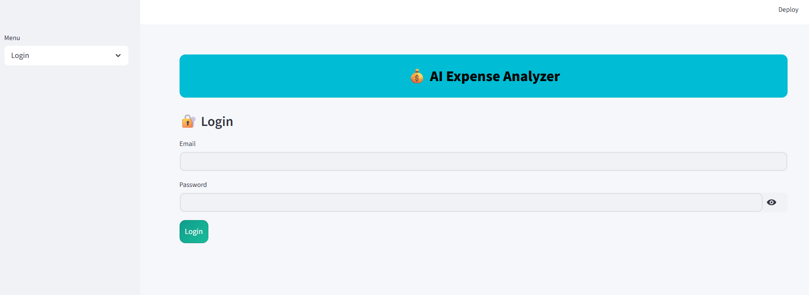
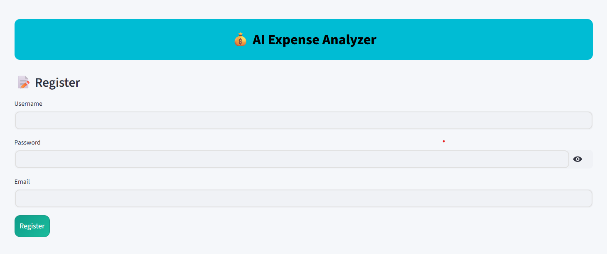
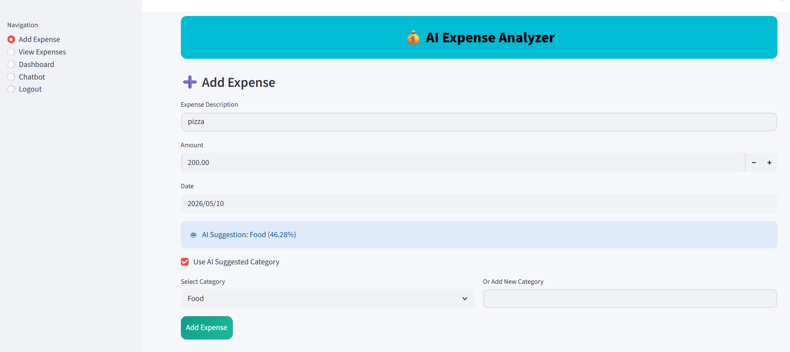
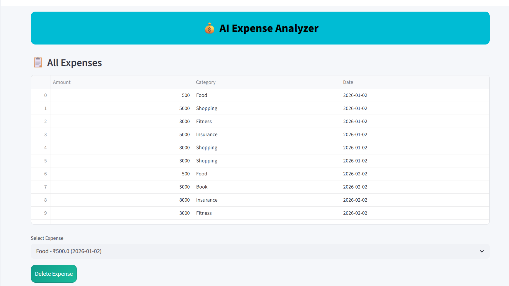
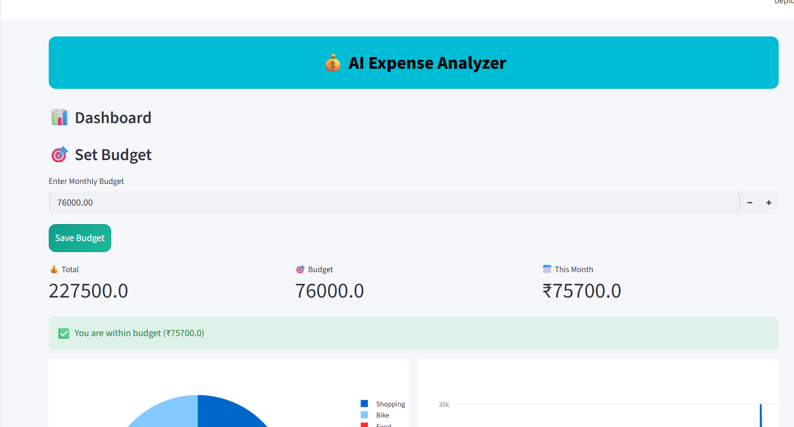
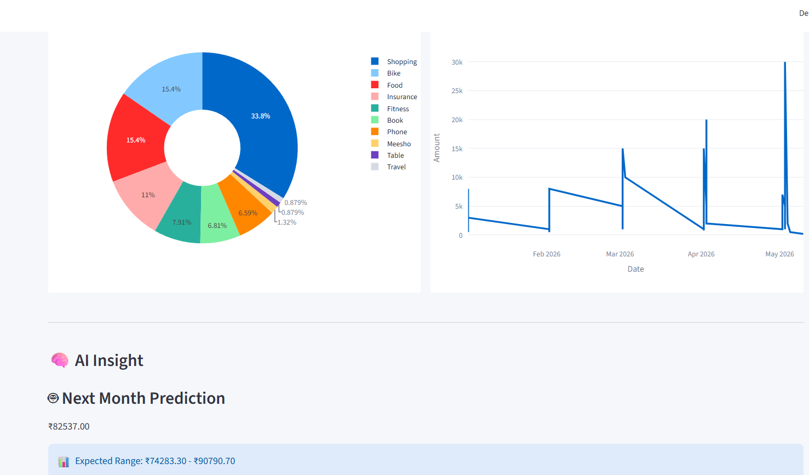
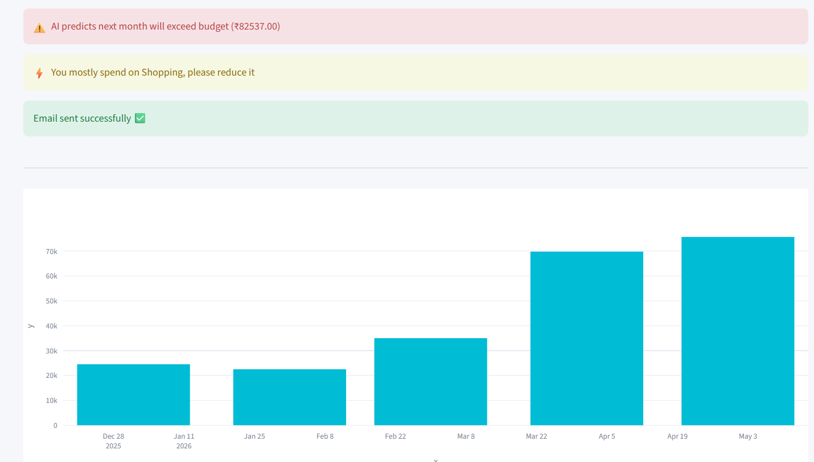
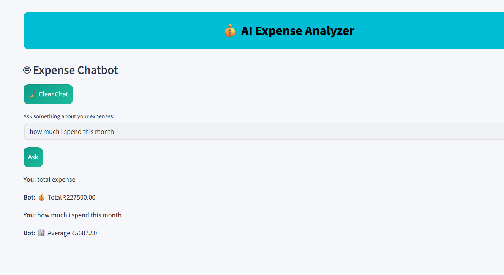
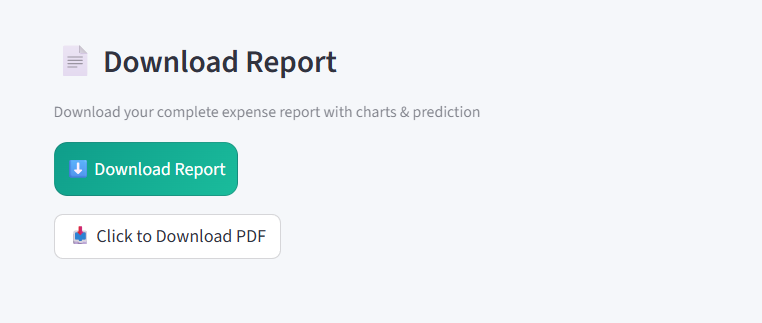
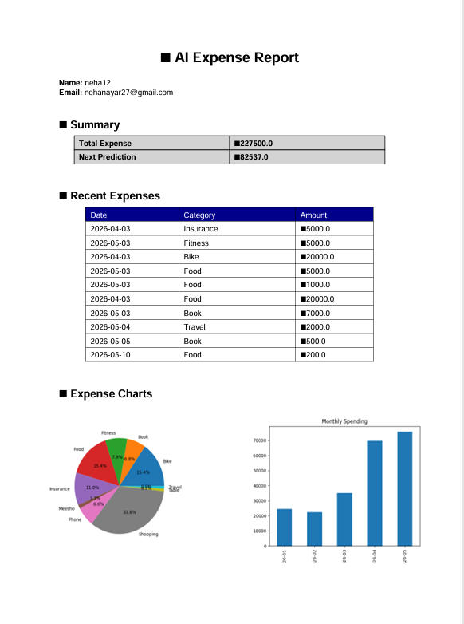

# 💰 AI Expense Analyzer

An AI-powered expense tracking and forecasting web application built using Python, Streamlit, Machine Learning, NLP, and SQLite.

---

## 🌐 Live Demo

👉 Try the app here:  
https://ai-expense-analyzer-neha.streamlit.app/

# 🚀 Features

✅ User Authentication System  
✅ Add & Manage Expenses  
✅ AI-based Expense Category Prediction  
✅ Monthly Expense Forecasting using ML  
✅ Interactive Dashboard & Charts  
✅ Expense Chatbot  
✅ PDF Report Generation  
✅ Email Alerts & Notifications  
✅ Budget Tracking System  

---

# 🧠 AI & ML Features

- NLP-based category prediction using Sentence Transformers
- Expense forecasting using Prophet Machine Learning model
- AI chatbot for expense insights
- Smart spending analysis

---

# 🛠 Technologies Used

| Technology | Purpose |
|---|---|
| Python | Backend Logic |
| Streamlit | Web Application |
| SQLite | Database |
| Pandas | Data Processing |
| Plotly | Interactive Charts |
| Sentence Transformers | NLP / AI |
| Prophet | Expense Prediction |
| ReportLab | PDF Reports |
| SMTP | Email Notifications |

---

# 📂 Project Structure

```bash
AI-Expense-Analyzer/
│
├── main.py
├── auth.py
├── database.py
├── model.py
├── report.py
├── requirements.txt
├── README.md
├── .gitignore
└── .env
```

---

# ▶️ How To Run

## 1️⃣ Clone Repository

```bash
git clone https://github.com/Nehanayar/AI-Expense-Analyzer.git
```

## 2️⃣ Install Dependencies

```bash
pip install -r requirements.txt
```

## 3️⃣ Run Application

```bash
streamlit run main.py
```

---

# 🔐 Environment Variables


This project requires email credentials for sending alerts and reports.

Create a `.env` file locally or configure Streamlit Secrets:

EMAIL_USER=your_email@gmail.com

EMAIL_PASS=your_app_password
```

---

# 📊 Dashboard Includes

- Expense Pie Charts
- Monthly Spending Graphs
- Budget Analysis
- AI Insights
- ML Forecasting

---

# 📄 PDF Reports

The system generates downloadable PDF reports with:
- Expense Summary
- Charts
- Predictions
- Recent Transactions

---

# 🤖 Chatbot Features

Users can ask:
- Total expense
- Average spending
- Highest spending category

---

# 📸 Screenshots

## Login Page


## Register Page


## Add Expense


## View Expenses


## Dashboard Overview


## Dashboard Analytics


## AI Insights


## Chatbot


## Report Generation


## PDF Report


---

# 👩‍💻 Author

Neha Nayar

---

# ⭐ Future Improvements

- Cloud Deployment
- OCR Bill Scanner
- Voice Assistant
- Advanced AI Recommendations
- Mobile Responsive UI
